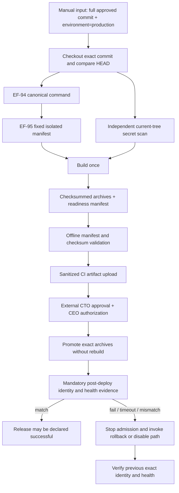

# EF-93 Production Deployment Gate

## Status and authority boundary

This repository implements a **Production Readiness / Artifact Gate**, not a Production deployment workflow. Passing it means only that a specific checksummed artifact and its evidence are ready for independent authorization review. It does not mean Production Ready, Production activated, QA passed, or release authorized.

Production activation always requires both:

1. recorded CTO technical approval for the exact readiness manifest and artifact checksum; and
2. explicit CEO release authorization for that same artifact identity.

Repository code does not configure GitHub Production environment reviewers, protected branches, host permissions, or credentials. A protected Production environment with least-privilege access and required reviewers is an external prerequisite that must be independently configured and evidenced before activation.

## Two-stage strategy



The repository implements and tests through `U`. Nodes `A` onward are a contract only and are never connected to Production by EF-93.

## Stage A — readiness and immutable artifact

The manual `.github/workflows/production-readiness.yml` workflow accepts only:

- `approved_commit`: a lowercase full 40-character Git commit; and
- `environment`: the sole choice `production`.

The workflow checks out `approved_commit`, derives `git rev-parse HEAD`, and fails unless they are equal. An unknown commit fails checkout. Application version is derived from the checked-out root `package.json`; build time is generated once in UTC. No mutable `latest` ref is accepted as artifact identity.

The workflow independently requires:

- the EF-94 canonical command `pnpm run test:release`;
- the EF-95 fixed `scripts/release-suite.manifest.json` and isolated runner reached through that command; and
- the existing current-tree Gitleaks policy.

`artifact-readiness` has an explicit `needs` dependency on all three jobs. There is no `continue-on-error`, failure swallowing, or `always()` path. A failed/missing identity, regression, isolation suite, secret scan, build, checksum, validation, or upload therefore prevents readiness success.

The frontend and backend are built once, packaged into deterministic archives, hashed, and uploaded with the manifest. Later activation may only promote those exact downloaded bytes after rechecking their checksums. Rebuilding from the same Git commit is not equivalent and is prohibited by this contract.

### Machine-readable manifest

Synthetic example (values are illustrative, not an authorization):

```json
{
  "schemaVersion": 1,
  "manifestType": "emotionflow-production-readiness",
  "gitCommit": "aaaaaaaaaaaaaaaaaaaaaaaaaaaaaaaaaaaaaaaa",
  "applicationVersion": "1.0.0",
  "buildTime": "2026-08-14T01:02:03Z",
  "environment": "production",
  "artifacts": [
    {
      "name": "frontend.tar.gz",
      "sha256": "cccccccccccccccccccccccccccccccccccccccccccccccccccccccccccccccc",
      "sizeBytes": 12345
    },
    {
      "name": "backend.tar.gz",
      "sha256": "dddddddddddddddddddddddddddddddddddddddddddddddddddddddddddddddd",
      "sizeBytes": 6789
    }
  ],
  "checks": [
    {
      "id": "ef-94-release-gate",
      "status": "passed",
      "command": "pnpm run test:release"
    },
    {
      "id": "ef-95-isolated-release-regression",
      "status": "passed",
      "command": "pnpm run test:release",
      "evidenceSha256": "eeeeeeeeeeeeeeeeeeeeeeeeeeeeeeeeeeeeeeeeeeeeeeeeeeeeeeeeeeeeeeee"
    },
    {
      "id": "gitleaks-current-tree",
      "status": "passed",
      "command": "gitleaks detect --no-git --redact"
    }
  ],
  "provenance": {
    "repository": "synthetic/repository",
    "workflow": "Production Readiness Gate",
    "runId": "100",
    "runAttempt": "1"
  }
}
```

The uploaded evidence set contains only the two archives, manifest, manifest checksum, and sanitized gate summary. Evidence must not include credentials, tokens, cookies, authorization headers, raw prompts/messages, user identifiers, real-user data, or Production responses containing such data. CI retention is 30 days; any longer restricted retention is an external governance/storage decision and must preserve access control and redaction.

## Stage B — activation and post-deploy gate (contract only)

Before any activation, the release operator must record:

- the authorized readiness manifest SHA-256;
- both archive SHA-256 values revalidated after download;
- CTO approval identity and timestamp;
- CEO authorization identity and timestamp;
- protected Production environment/reviewer evidence;
- the currently active rollback target's exact commit, version, build time and artifact-manifest checksum;
- backup/integrity proof for that rollback target; and
- an approved stop-admission/disable mechanism.

Activation must promote the approved archives without rebuilding, modifying, or repackaging them. No `latest` artifact or branch name may substitute for a checksum.

### Mandatory post-deploy verification

The operator collects sanitized evidence and runs the side-effect-free command below. The validator reads local JSON files only; it performs no request itself.

```bash
node scripts/production-readiness-gate.mjs validate-postdeploy \
  --manifest production-readiness-manifest.json \
  --evidence production-post-deploy-evidence.json \
  --approved-manifest-sha256 <separately-recorded-64-character-digest>
```

`--approved-manifest-sha256` is mandatory and comes from the separately recorded CTO/CEO authorization record. It must not be copied or derived from the post-deploy evidence JSON. The validator computes the supplied local manifest's SHA-256 and requires a three-way equality:

```text
external approved digest
= computed local readiness-manifest digest
= evidence.manifestSha256
```

Missing, malformed, or mismatched values fail non-zero.

Evidence must prove all of the following agree with the approved manifest:

- frontend artifact identity: commit, application version, build time, `environment=production`, health/availability;
- backend `/api/v1/version`: exact commit, application version, build time, `environment=production`;
- backend health: `ok`; and
- frontend and backend identities agree with each other.

Verification is non-skippable. A failure, timeout, missing field, DEV/ambiguous environment, unhealthy response, or identity mismatch means the release is **not successful**. Stop new admission, preserve evidence, and invoke the approved rollback/disable path. Do not repair or rebuild the candidate in place.

## Rollback contract

The rollback target must be captured before activation and must differ from the candidate. It is valid only when its exact commit, version, artifact-manifest checksum, backup location/control evidence, and integrity verification are present. Absence of these facts is a hard blocker, not a known limitation.

Rollback triggers include:

- frontend/backend identity mismatch;
- environment other than `production`;
- health failure or verification timeout;
- artifact checksum mismatch;
- integrity/data/authentication/authorization/ownership failure; or
- inability to verify the candidate independently.

After rollback, `rollbackVerification` must be an object with separate `frontend` and `backend` identities. Each side must independently show the rollback target's exact commit, application version and build time, plus `environment=production` and health `ok`; the two sides must also agree with each other. A flat legacy identity, a missing side, or any mismatch/unhealthy/non-production side fails closed. Until this verification passes, admission remains stopped and neither candidate activation nor rollback may be declared successful.

Infrastructure-specific commands, hostnames, backup technology, timeout values, monitoring source, approver configuration, and stop-admission mechanism are external prerequisites intentionally absent from EF-93. If they cannot be made verifiable before an authorized release, Production activation must not begin.

## Local verification

```bash
pnpm run test:production-gate
pnpm run test:release-runner
pnpm run test:release
git diff --check
```

The focused tests cover the valid synthetic path and reject malformed/unknown identity, non-production environment, missing version/time, malformed schema, checksum tampering, changed canonical check provenance or EF-95 manifest digest, missing/failed EF-94/EF-95/secret checks, missing/malformed/mismatched external approved-manifest digest, post-deploy mismatch/unhealthy evidence, flat or incomplete rollback proof, two-sided rollback mismatches, unsafe rollback targets, and secret-like/raw-user fields.
