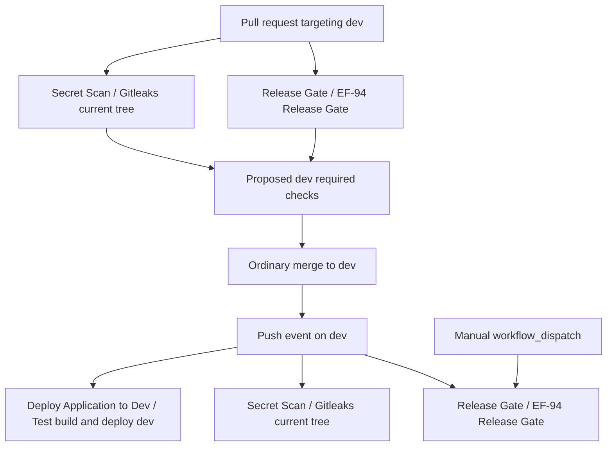

# EF-94 CI Release Gate and dev Protection

## CI contract

The workflow `.github/workflows/release-gate.yml` has the fixed workflow name `Release Gate` and job/check name `EF-94 Release Gate`. It runs for pull requests targeting `dev`, pushes to `dev`, and manual `workflow_dispatch` runs. The job checks out the candidate, installs the repository-declared pnpm 9.0.0 dependencies with `pnpm install --frozen-lockfile`, and executes the canonical `pnpm run test:release` command.

The workflow does not select suites. `scripts/release-suite.manifest.json` remains the sole canonical suite authority. The job has a finite 20-minute timeout, no `continue-on-error`, and no failure-swallowing step. A dependency bootstrap, runner, suite, signal, or cleanup failure therefore produces a non-zero job result. Concurrency cancellation is keyed to the pull-request number or full branch ref, so only an older run for the same PR or branch is cancelled.

The workflow grants only `contents: read`, declares no secrets, and does not call databases, deployment workflows, DEV/Production APIs, or mutating smoke scripts. The approved EF-95 suite remains synthetic and isolated as documented in `docs/EF-95-isolated-release-regression.md`.

## dev branch protection proposal

After this workflow is stable and CTO Code Gate approves configuration, configure the `dev` branch ruleset or branch protection as follows:

1. In repository **Settings → Rules → Rulesets** (or **Branches → Branch protection rules**), select only branch `dev`.
2. Require a pull request before merging according to the existing repository policy.
3. Enable required status checks and require branches to be up to date if that is the existing integration policy.
4. Add the exact required check `EF-94 Release Gate`.
5. Retain the independent existing required check `Gitleaks (current tree)`; never replace it with the release gate.
6. Do not make the push-only deployment check `Test, build and deploy dev` a PR pre-merge requirement because that workflow does not run on pull requests.
7. Save the rule without bypassing required checks for ordinary contributors. Any administrator bypass policy remains an explicit governance decision outside this PR.

Enable protection only after at least one targeting-`dev` pull request has produced a successful `EF-94 Release Gate` check, so GitHub can resolve the exact check identity. A maintainer verifies enforcement by opening a disposable synthetic PR targeting `dev`, confirming both `EF-94 Release Gate` and `Gitleaks (current tree)` appear independently, and observing that merge is blocked while the release check is pending or failing and allowed by this rule only after it succeeds. The workflow run must show `pnpm run test:release` as the executed gate command.

No branch protection or ruleset is changed by this PR; the steps above are the post-Code-Gate configuration proposal.

## Workflow and check dependency graph

The release and secret gates are independent pre-merge candidates. The existing deployment workflow has no pull-request trigger and remains a post-merge push-to-`dev` workflow; EF-94 does not make it a dependency of, or replacement for, either pre-merge check.

## Failure-path evidence

The workflow contract test rejects `continue-on-error`, missing timeouts, mutable install commands, secret references, and any command other than the canonical release command. EF-95 runner tests separately prove suite, invalid-manifest/bootstrap, cleanup, and captured-signal failures reject and yield non-zero CLI results. In GitHub, a maintainer can validate enforcement without real data by using a temporary PR whose synthetic test change makes an approved suite fail; `EF-94 Release Gate` must conclude `failure`, and the protected `dev` merge must remain blocked. Remove that synthetic change rather than weakening the workflow.

## Safe disable and rollback

For an approved temporary gate suspension:

1. Remove only `EF-94 Release Gate` from the `dev` required checks. Keep `Gitleaks (current tree)` required and active.
2. Disable the `Release Gate` workflow in the Actions UI, or revert only the commit that introduced `.github/workflows/release-gate.yml`. Do not edit `secret-scan.yml` or `deploy-dev.yml`.
3. Confirm disabling the release gate did not dispatch `Deploy Application to Dev`; workflow disablement and ruleset edits must not create a push to `dev`.
4. Record the approval, reason, owner, and restoration deadline through the normal governance process.

To restore the gate, re-enable or restore the workflow, run it with `workflow_dispatch`, and confirm the workflow still emits the exact successful check `EF-94 Release Gate`. Then add that exact check back to the `dev` required checks and re-run the disposable-PR pending/failure/success enforcement verification. Gitleaks remains active throughout rollback and restoration.
